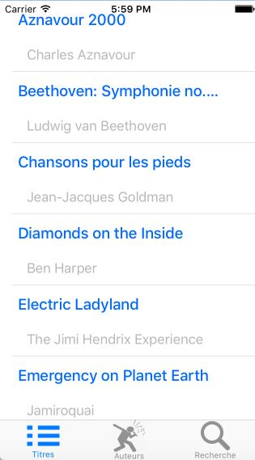
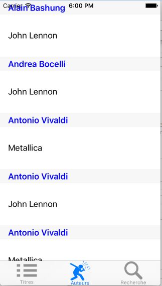
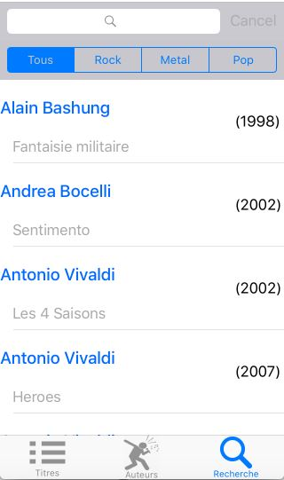

## Description

The objective of this mini project is to develop a multi-view iPhone application that implements the tabbed view controller and component that displays lists. The application presents to the user a list of Cds that he can see under different arrangements.

## Features

**List of Cds**
The first tab displays a list of Cds sorted by order
alphabetical on the title of the CD. 
 

 
**List of Authors**
The second tab shows the list of authors sorted by order
alphabetical by name.
 

 
**Search for Cds**
The third tab displays a search field and lists the Cds that correspond to the genre musical that the user is typing into the input field.
 

 

## Technologies
Swift, Cocoa Touch, XCode, ios 10

